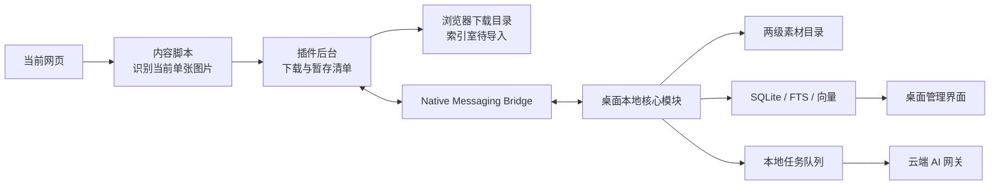
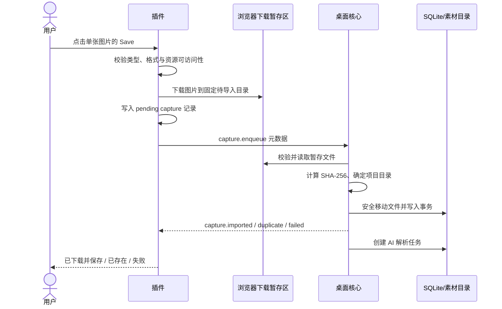
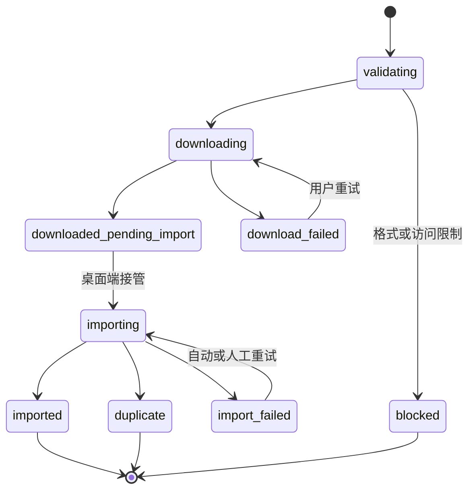
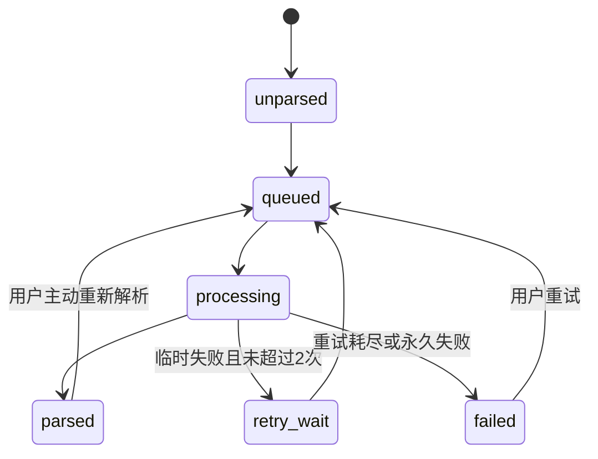

# 索引室 MVP 技术架构与数据模型

> 文档状态：Draft v1.0  
> 产品范围：Chrome 浏览器插件＋Windows 原生桌面应用＋云端 AI 服务  
> 关联文档：[PRD](./PRD.md)｜[SPEC](./SPEC.md)｜[UX Flow](./UX_FLOW.md)｜[Wireframes](./WIREFRAMES.md)

## 1. 文档目的

本文件把已经确认的产品需求转化为可实施的系统设计，回答以下问题：

- 用户点击 Save 后，图片和元数据如何进入本地素材库。
- 桌面端完全退出时，为什么仍然可以真正下载图片。
- 桌面端下次启动后，如何自动归档、去重和进入 AI 解析队列。
- 图片、项目、来源、描述、关键词和搜索索引如何建模。
- 插件、桌面端和云端 AI 之间传递哪些数据。
- 失败、崩溃、断网和网站限制发生时如何恢复。

本文是 MVP 的技术基线，不等同于最终工程实现。编码前允许通过技术验证调整具体库，但不得改变已经确认的产品行为。

## 2. 架构原则

1. **本地原图优先**：图片原文件、项目关系、标签与索引以用户本地数据为准。
2. **一次采集链路**：在线保存和离线暂存共用同一条“浏览器下载 → 暂存记录 → 桌面端导入”链路。
3. **用户选择优先**：插件选择的项目类型决定物理目录，AI 不得自动移动项目文件夹。
4. **人工修改优先**：人工修改的描述和标签不得被普通重新解析覆盖。
5. **结果可解释**：已下载、已正式归档、已暂存、未保存和解析失败必须是不同状态。
6. **失败可恢复**：文件写入和数据库写入不假设一次成功；所有后台任务都能重试或恢复。
7. **最小权限**：不绕过网站访问控制，不让桌面端接受任意文件路径或任意系统命令。
8. **供应商可替换**：AI 图片理解、文本向量和查询理解通过统一接口接入。

## 3. MVP 技术选型建议

| 层级 | 建议选型 | MVP 选择理由 |
| --- | --- | --- |
| 浏览器插件 | Chrome Manifest V3＋TypeScript＋轻量原生 DOM | 聚焦单一浏览器，插件界面小，不需要引入重型 UI 框架 |
| 桌面应用 | Electron＋React＋TypeScript | Windows MVP 开发快，Node 文件系统、托盘、自动更新和插件通信生态成熟 |
| 本地数据库 | SQLite＋FTS5 | 单文件、可迁移、适合约 5,000 张素材和本地全文检索 |
| 向量检索 | SQLite 保存向量 BLOB＋进程内余弦排序 | 5,000 张规模无需独立向量数据库，部署简单 |
| 图片处理 | Sharp | 读取尺寸、生成缩略图、转换 AI 上传代理图 |
| 本地任务队列 | SQLite 持久化 Job 表＋桌面主进程 Worker | 重启后可恢复，不额外部署 Redis 或后台服务 |
| 插件通信 | Chromium Native Messaging | 不开放本地 HTTP 端口，可限制允许连接的插件 ID |
| 云端接口 | HTTPS JSON API＋可替换 Provider Adapter；首个 Provider 为千问 | 隐藏开发者百炼 API Key，并允许替换模型 |

### 3.1 为什么 MVP 推荐 Electron

Electron 的安装包与内存占用较大，但当前阶段更重要的是快速验证完整产品闭环。它能直接复用 TypeScript，并降低文件系统、系统托盘、协议唤起和 Native Messaging 的集成成本。

若产品验证成立且性能成为真实问题，再评估迁移 Tauri。MVP 不同时维护 Electron 和 Tauri 两套桌面实现。

## 4. 系统边界



### 4.1 浏览器插件负责

- 用户主动开启或关闭图片保存功能。
- 显示和维护当前项目类型。
- 识别用户当前指向的单张内容图片。
- 获取最佳可访问资源，不绕过登录、付费墙或访问控制。
- 读取网页标题、页面 URL、网站名称、图片 URL 和采集时间。
- 将图片真正下载到固定暂存目录。
- 在插件本地保存待导入清单。
- 与桌面端交换连接状态和导入结果。

插件不负责图库、AI 分析、搜索、标签管理和长期采集历史。

### 4.2 桌面本地核心模块负责

- 验证插件消息与暂存文件。
- 创建或复用项目类型与项目文件夹。
- 计算内容哈希并执行项目内完全重复去重。
- 将文件从暂存区安全移动到正式素材目录。
- 写入 SQLite、全文索引和后台任务。
- 生成缩略图并监听本地文件变化。
- 调度 AI 解析、失败重试和搜索。
- 向桌面 UI 提供统一的本地应用服务。

核心模块属于桌面应用内部，用户不需要单独安装或启动服务。

### 4.3 云端 AI 服务负责

- 图片语义描述。
- 优先从当前有效预设词库选择关键词；预设不足时每张图片最多自主新增 5 个标签。
- 生成图文检索向量。
- 解析自然语言查询。
- 用户鉴权、免费解析额度、调用限流、成本和失败率记录。

云端不保存用户的完整本地素材库，也不是图片、项目和标签关系的权威数据源。

首个模型 Provider 采用阿里云百炼千问。质量验证阶段使用 `qwen3.7-plus`，在同一批建筑图片人工标注集上与 `qwen3.7-flash` 对照评测后，再决定正式 MVP 的默认模型。开发者 API Key 只存在于云端密钥环境或密钥管理服务中；浏览器插件、桌面安装包和普通用户设置页均不得包含该 Key。

## 5. 统一采集链路

### 5.1 桌面端运行时



### 5.2 桌面端完全退出时

1. 插件仍将图片下载到固定待导入目录。
2. 插件将元数据写入 `chrome.storage.local` 的待导入清单。
3. 插件显示“已下载并暂存，打开桌面端后自动整理”。
4. 此时图片尚未进入正式项目目录、SQLite 和 AI 队列。
5. 桌面端下次启动并连接后，插件发送全部待导入记录。
6. 桌面端逐条导入并回传确认；只有收到确认后插件才删除对应清单记录。

这意味着“浏览器下载完成”和“桌面端正式归档完成”是两个不同的事实。

## 6. 浏览器暂存设计

### 6.1 暂存目录

建议使用浏览器下载目录下的相对路径：

```text
Downloads/
└─ 索引室待导入/
   ├─ 2026-08/
   │  ├─ {capture_id}.jpg
   │  └─ {capture_id}.png
```

插件不得写入浏览器下载目录之外的任意路径。

### 6.2 待导入记录

待导入元数据保存在插件本地存储，不创建包含敏感 URL 的公开旁车文件。

```json
{
  "schema_version": 1,
  "capture_id": "018f...uuidv7",
  "status": "downloaded_pending_import",
  "download_id": 341,
  "temporary_path": "C:\\Users\\...\\Downloads\\索引室待导入\\2026-08\\018f.jpg",
  "content_hash": null,
  "mime_type": "image/jpeg",
  "byte_size": 2481932,
  "project_type_name": "文化建筑",
  "page_title": "沿山艺术中心",
  "page_url": "https://example.com/project/123",
  "image_url": "https://example.com/image.jpg",
  "site_name": "Example",
  "captured_at": "2026-08-10T10:30:00+08:00"
}
```

浏览器完成下载时无法直接读取下载文件内容，因此 `content_hash` 允许暂时为空；桌面端接管文件后计算 SHA-256，并将结果写入 CaptureJob、Asset 和导入回执。

### 6.3 暂存清理规则

- 浏览器下载完成：取得暂存绝对路径后立即删除 Chrome 临时下载历史项，再交给桌面宿主移动，避免下载栏先观察到暂存文件消失而显示“已删除”。
- 导入成功：桌面端移动文件，插件收到确认后删除清单记录；最终文件不受影响。
- 项目内重复：桌面端不再创建副本；确认后清理暂存文件、清单记录和 Chrome 临时下载历史项。
- 成功或重复回执必须返回 `managed_path`；插件可在临时反馈中请求桌面宿主打开资源管理器并选中该文件。
- 暂存文件缺失：记录变为 `missing_file`，允许从原 URL 手动重试。
- 连续 30 天未导入：插件提醒用户打开桌面端，不自动删除图片。
- 用户主动清理：必须显示影响范围并二次确认。

### 6.4 插件持久化状态

插件仅保存完成采集所必需的轻量状态：

| Key | 内容 | 清理规则 |
| --- | --- | --- |
| `copyright_ack_v1` | 是否确认当前版本版权提示 | 提示版本更新时重新确认 |
| `default_project_type` | 最近一次有效项目类型 | 用户更改时覆盖 |
| `custom_project_types_cache` | 桌面端同步的用户自定义类型缓存 | 重连后以桌面端为准合并 |
| `pending_captures` | 尚未收到终态确认的暂存记录 | imported / duplicate 确认后逐条删除 |
| `capture_statuses` | 最近 50 条采集状态回执，用于补偿页面消息竞态 | 按更新时间滚动淘汰 |
| `schema_version` | 插件存储结构版本 | 升级时迁移 |

桌面连接状态不持久化为事实，每次打开插件时重新探测，避免桌面端已经退出但界面仍显示“已连接”。

## 7. 文件与项目目录规则

### 7.1 正式目录

```text
素材库根目录/
└─ {项目类型}/
   └─ {项目名称}/
      ├─ {采集时间}_{短ID}.{扩展名}
      └─ ...
```

- 第一层来自插件选择的预设或自定义项目类型。
- 第二层默认来自网页标题。
- 同一标准化页面 URL 后续采集复用同一 `project_id`。
- 同名但不同来源页面不强行合并，文件夹名使用 `名称（2）` 等可读后缀。

### 7.2 Windows 名称清理

- 替换 `<>:"/\\|?*` 等非法字符。
- 去除末尾空格和句点。
- 避免 `CON`、`PRN`、`AUX`、`NUL`、`COM1` 等保留名称。
- 空标题回退为“网站名称＋采集日期”。
- 单层目录名称建议限制在 80 个字符内，同时在数据库保留完整原始标题。

### 7.3 文件名策略

MVP 使用“采集时间＋capture_id 短码”，避免依赖不稳定或重复的远端文件名。原始文件名可作为元数据保存，但不作为唯一标识。

## 8. 核心数据模型

所有 ID 使用 UUIDv7 或同等的稳定、可排序 ID；时间统一以 ISO 8601 保存，数据库内部建议使用 UTC。

### 8.1 ProjectType

| 字段 | 类型 | 说明 |
| --- | --- | --- |
| id | text PK | 稳定 ID |
| name | text unique | 显示名称 |
| normalized_name | text unique | 去空白、大小写归一后的名称 |
| origin | enum | `system` / `user` |
| folder_path | text | 第一层目录绝对路径 |
| status | enum | `active` / `archived` |
| created_at / updated_at | datetime | 时间戳 |

### 8.2 Project

| 字段 | 类型 | 说明 |
| --- | --- | --- |
| id | text PK | 项目 ID |
| project_type_id | text FK | 所属项目类型 |
| name | text | 用户可修改名称 |
| generated_name | text | 网页标题生成的初始名称 |
| canonical_page_url | text nullable | 用于复用同一网页项目 |
| folder_path | text unique | 第二层物理目录 |
| status | enum | `active` / `archived` |
| created_at / updated_at | datetime | 时间戳 |

### 8.3 Asset

| 字段 | 类型 | 说明 |
| --- | --- | --- |
| id | text PK | 素材 ID |
| project_id | text FK | 所属物理项目 |
| capture_id | text nullable | 对应插件采集请求 |
| managed_path | text unique | 正式图片路径 |
| content_hash | text | SHA-256，用于完全重复判断 |
| mime_type | text | JPEG / PNG / WebP |
| width / height | integer | 像素尺寸 |
| byte_size | integer | 文件大小 |
| parse_status | enum | AI 解析状态 |
| created_at / updated_at | datetime | 时间戳 |

索引：`(project_id, content_hash)` 唯一，用于“同一项目内完全重复去重”。不同项目允许相同 `content_hash`。

### 8.4 Source

| 字段 | 类型 | 说明 |
| --- | --- | --- |
| asset_id | text PK/FK | 对应素材 |
| image_url | text nullable | 原始图片 URL |
| page_url | text nullable | 来源页面 URL |
| page_title | text nullable | 原始网页标题 |
| site_name | text nullable | 网站名称 |
| original_filename | text nullable | 远端原始文件名 |
| captured_at | datetime | 采集时间 |

来源字段缺失不阻止导入，但 UI 必须明确显示“来源信息缺失”。

### 8.5 Tag 与 AssetTag

`Tag` 保存词本身及专业维度；`AssetTag` 保存某张图片与标签的关系。

| AssetTag 字段 | 说明 |
| --- | --- |
| asset_id / tag_id | 联合主键 |
| origin | `ai` / `user` |
| state | `active` / `removed` |
| confidence | AI 置信度，人工标签为空 |
| source_model | AI 模型版本，人工标签为空 |
| manually_edited | 是否经过人工确认或修改 |
| created_at / updated_at | 时间戳 |

标签被人工删除后保留关系历史，但不参与当前搜索。普通重新解析不得恢复被人工明确删除的标签。

### 8.6 AIAnalysis

| 字段 | 说明 |
| --- | --- |
| id / asset_id | 分析记录及素材 ID |
| status | `queued` / `processing` / `succeeded` / `failed` |
| ai_description | 最近一次 AI 原始描述 |
| effective_description | 当前生效描述，可由用户修改 |
| description_manually_edited | 人工修改保护标记 |
| model_version / vocabulary_version / embedding_version | 可追踪版本 |
| embedding | Float32 向量 BLOB |
| error_code / error_message | 可理解失败原因 |
| attempt_count / next_retry_at | 重试信息 |
| created_at / updated_at | 时间戳 |

### 8.7 CaptureJob

用于跨文件系统和数据库的恢复，不把导入过程视为不可中断的一次操作。

| 字段 | 说明 |
| --- | --- |
| capture_id | 与插件幂等键一致 |
| state | 见采集状态机 |
| temporary_path / target_path | 暂存与目标路径 |
| project_type_name / page_title | 导入上下文 |
| content_hash | 完全重复判断 |
| error_code / attempt_count | 失败与重试 |
| created_at / updated_at | 时间戳 |

### 8.8 EditHistory

| 字段 | 说明 |
| --- | --- |
| id / asset_id | 历史 ID 与素材 ID |
| action_type | 描述修改、标签新增、标签删除等 |
| before_json / after_json | 可恢复快照 |
| created_at | 操作时间 |

每张图片最多保留最近 50 个编辑快照，支持连续撤销。

### 8.9 其他产品实体

| 实体 | 关键字段与作用 |
| --- | --- |
| Collection | `id`、`name`、`created_at`；逻辑收藏夹，不创建图片副本 |
| AssetCollection | `asset_id`、`collection_id`；图片与收藏夹多对多关系 |
| WatchedFolder | `id`、`path`、`status`、`last_scan_at`；本地监听目录 |
| IgnoreRecord | `source_path`、`content_hash`、`ignored_at`；避免被移除图片再次导入 |
| SearchSession | `id`、`query`、`parsed_conditions_json`、`result_count`、`created_at`；默认仅保存在本地 |

这些实体与采集链路共用同一 SQLite，不另建“插件数据库”或“AI 数据库”。

## 9. 插件与桌面端通信契约

### 9.1 连接方式

使用 Chromium Native Messaging：

- 安装器注册允许连接的扩展 ID 与本地桥接程序。
- 桌面应用运行或后台驻留时，桥接程序连接本地核心模块。
- 桌面端完全退出时，插件连接失败即进入离线暂存，不循环弹窗打扰用户。
- 二进制图片不通过消息通道传输，只传递暂存文件引用和元数据。

### 9.2 消息信封

```json
{
  "schema_version": 1,
  "message_id": "uuidv7",
  "type": "capture.enqueue",
  "sent_at": "2026-08-10T02:30:00Z",
  "payload": {}
}
```

### 9.3 核心消息

| 消息 | 方向 | 用途 |
| --- | --- | --- |
| `app.hello` | 插件 → 桌面 | 协议版本、插件版本和待导入数量 |
| `app.status` | 桌面 → 插件 | 在线、后台运行、忙碌或需升级 |
| `capture.enqueue` | 插件 → 桌面 | 提交一条已下载暂存记录 |
| `capture.fetch` | 插件 → Native Host | 仅针对允许的小红书图片域名，由本地宿主获取用户当前可见图片并直接归档 |
| `library.reveal` | 插件 → 桌面 | 用户主动请求打开素材库根目录 |
| `capture.result` | 桌面 → 插件 | imported、duplicate 或 failed |
| `capture.pending.list` | 插件 → 桌面 | 重连后同步待导入记录 |
| `capture.pending.ack` | 桌面 → 插件 | 明确确认已接收或已完成的 capture_id |
| `project_type.list` | 桌面 → 插件 | 同步预设及用户自定义类型 |
| `project_type.upsert` | 插件 → 桌面 | 创建或更新当前自定义类型 |

### 9.4 `capture.enqueue` 示例

```json
{
  "schema_version": 1,
  "message_id": "0198-message",
  "type": "capture.enqueue",
  "sent_at": "2026-08-10T02:30:00Z",
  "payload": {
    "capture_id": "0198-capture",
    "temporary_path": "C:\\Users\\...\\索引室待导入\\2026-08\\0198.jpg",
    "content_hash": "sha256:abc123",
    "mime_type": "image/jpeg",
    "project_type_name": "文化建筑",
    "page_title": "沿山艺术中心",
    "page_url": "https://example.com/project/123",
    "image_url": "https://example.com/image.jpg",
    "site_name": "Example",
    "captured_at": "2026-08-10T02:30:00Z"
  }
}
```

### 9.5 幂等规则

- `capture_id` 是一次采集请求的幂等键。
- 桌面端重复收到同一 `capture_id` 时返回既有结果，不重复移动或创建记录。
- 插件只有收到终态确认后才从待导入清单移除记录。
- 连接中断后，插件允许安全地重新发送全部非终态记录。

## 10. 状态机

### 10.1 采集状态



插件文案映射：

| 系统状态 | 用户反馈 |
| --- | --- |
| `downloading` | 保存中… |
| `downloaded_pending_import` | 已下载并暂存，打开桌面端后自动整理 |
| `imported` | 已整理到：{项目类型} / {项目名称}；可打开所在文件夹 |
| `duplicate` | 当前项目已存在：{项目类型} / {项目名称}；可打开所在文件夹 |
| `download_failed` / `import_failed` | 显示真实失败分类和重试 |
| `blocked` | 明确显示未保存及原因 |

### 10.2 AI 解析状态



普通重新解析只更新 AI 原始结果；人工描述、人工标签和人工删除记录继续生效。

## 11. AI Provider 接口

桌面端只依赖统一接口，不直接散落调用某个模型 SDK：

```ts
interface AIProvider {
  analyzeImage(input: {
    imageProxy: Uint8Array;
    vocabulary: VocabularyItem[];
    locale: 'zh-CN';
  }): Promise<{
    description: string;
    selectedTagIds: string[];
    createdKeywords: string[];
    embedding: number[];
    modelVersion: string;
  }>;

  interpretQuery(input: {
    query: string;
    vocabulary: VocabularyItem[];
  }): Promise<{
    normalizedQuery: string;
    concepts: string[];
    embedding: number[];
    modelVersion: string;
  }>;
}
```

上传 AI 前由桌面端生成限制长边和体积的代理图；本地原图不因分析而被修改。模型输入、留存时间和接收方需在真实测试前完成合规评估。

## 12. 搜索实现

### 12.1 三路召回

1. SQLite FTS5：描述、项目名称、网页标题和关键词文本。
2. 精确关系过滤：项目类型、项目、关键词标签和解析状态。
3. 向量相似度：自然语言查询向量与图片向量的余弦相似度。

MVP 将三路分数归一化后加权排序，并在结果卡片显示主要匹配原因。

### 12.2 查询优先级规则

- 用户提交新的非空自然语言查询时，清除提交前选择的项目和关键词条件。
- 自然语言先检索整个素材库。
- 结果出现后用户新选择的项目或关键词作为 AND 精筛。
- 项目和多个关键词之间保持 AND。
- AI 查询服务不可用时，保留 FTS5、关键词和项目筛选，并显示降级提示。

建议在 UI 状态中明确记录条件产生时间：

```ts
type SearchContext = {
  query: string | null;
  querySubmittedAt: string | null;
  projectFilter: { id: string; appliedAt: string } | null;
  tagFilters: Array<{ id: string; appliedAt: string }>;
};
```

只有晚于 `querySubmittedAt` 的筛选条件才与当前自然语言结果组合。

## 13. 文件写入与崩溃恢复

文件系统与 SQLite 不能组成一个真正的跨系统事务，因此采用可恢复步骤：

1. 创建或恢复 `CaptureJob`。
2. 验证暂存路径必须位于允许的暂存根目录内。
3. 读取文件并计算 SHA-256。
4. 检查目标项目内是否存在相同内容哈希。
5. 将文件复制到目标目录的 `.partial` 临时文件。
6. 完成写入后原子重命名为正式文件名。
7. 在 SQLite 事务中写入 Asset、Source 和 AI Job。
8. 标记 CaptureJob 为 `imported`。
9. 删除原暂存文件并通知插件。

桌面端启动时扫描非终态 CaptureJob：

- 只有 `.partial`：删除临时文件并重试。
- 正式文件存在但数据库缺失：重新校验后补建记录。
- 数据库存在但文件缺失：标记文件异常，不伪装成功。

## 14. 错误分类

| 错误码 | 是否重试 | 用户含义 |
| --- | --- | --- |
| `UNSUPPORTED_FORMAT` | 否 | 暂不支持该图片格式 |
| `RESOURCE_INACCESSIBLE` | 视情况 | 原图地址失效或不可访问 |
| `SITE_ACCESS_RESTRICTED` | 否 | 网站限制访问，不尝试绕过 |
| `DOWNLOAD_INTERRUPTED` | 是 | 下载中断，可原位重试 |
| `DOWNLOAD_PERMISSION_DENIED` | 是 | 检查浏览器下载权限 |
| `STAGING_FILE_MISSING` | 是 | 暂存文件不存在 |
| `LIBRARY_PERMISSION_DENIED` | 是 | 素材目录不可写 |
| `DISK_FULL` | 是 | 磁盘空间不足 |
| `PROJECT_DUPLICATE` | 否 | 当前项目已经保存相同文件 |
| `AI_NETWORK_ERROR` | 自动 | 网络异常，最多自动重试 2 次 |
| `AI_QUOTA_EXCEEDED` | 否 | 测试额度不足，等待恢复或人工处理 |
| `AI_INVALID_OUTPUT` | 自动 | 模型结果不可用，最多自动重试 2 次 |

## 15. 安全与隐私

- Native Messaging 只允许已登记的插件 ID。
- 所有消息进行 schema、长度、枚举和版本校验。
- 桌面端对路径进行标准化，拒绝暂存根目录外的输入路径。
- 项目名称只能作为名称，不得直接拼接未经清理的路径。
- 插件不持有云端 AI 密钥。
- AI 密钥只存在于产品后端，不下发到客户端。
- 来源 URL 只用于溯源和重试，不等于获得版权授权。
- 不记录用户图片内容、完整搜索历史或来源 URL 到分析埋点。
- 详细统计必须单独同意，并允许撤回和删除。

## 16. 性能预算

MVP 目标以约 5,000 张本地图片为基准：

| 场景 | 目标 |
| --- | --- |
| 插件悬浮工具条出现 | 指针稳定后约 150 ms |
| 点击 Save 到开始下载反馈 | 100 ms 内 |
| 本地导入单张普通图片 | P95 小于 2 秒，不含下载 |
| 首页首批 8 张缩略图 | P95 小于 1 秒 |
| 关键词/项目筛选 | P95 小于 300 ms |
| 5,000 张向量本地重排 | P95 小于 500 ms |
| 人工编辑自动保存 | P95 小于 500 ms |

缩略图单独缓存，不在网格中直接解码原始大图。

## 17. 测试策略

### 17.1 单元测试

- Windows 文件夹名称清理与冲突规则。
- 项目内内容哈希去重。
- 搜索条件时间优先级。
- AI 结果与人工修改合并规则。
- 采集与解析状态机转换。
- 消息 schema 与路径验证。

### 17.2 集成测试

- 插件在线保存 → 正式目录 → SQLite → 未解析队列。
- 桌面端退出 → 插件暂存 → 重启自动导入。
- 导入过程中崩溃 → 重启恢复且不重复文件。
- 同一图片同项目重复与跨项目保存。
- 网络中断、磁盘满、权限不足和暂存文件缺失。
- 模型失败两次后进入人工重试。

### 17.3 重点网站测试

对通用网页、gooood、小红书和 Pinterest 分别记录：

- 目标图片识别率。
- 原图或最佳可用图获取成功率。
- 来源字段完整率。
- 保存耗时和失败分类。

测试只处理测试人员正常可见并有权访问的内容。

## 18. MVP 实施顺序

### Phase 0：高风险技术验证，2～3 天

1. Chrome 下载到固定相对暂存目录。
2. Electron 安装器注册 Native Messaging。
3. 插件离线积压并在重连后发送清单。
4. Windows 路径清理、文件移动和项目内 SHA-256 去重。

以上四项任何一项失败都会改变核心产品方案，应优先验证。

### Phase 1：本地采集闭环

- 插件开关、项目类型和单图 Save。
- 真实下载与来源记录。
- 桌面端正式归档、SQLite 和未解析页面。
- 成功、重复、离线暂存和失败反馈。

### Phase 2：AI 解析闭环

- 图片代理图。
- 描述、关键词、候选词和向量。
- 队列、自动重试和人工修正保护。

### Phase 3：检索与管理闭环

- FTS5、关键词和项目筛选。
- 自然语言查询与向量排序。
- 详情编辑、连续撤销、来源溯源和原图查看。

### Phase 4：安装与试用验证

- 一体化安装与插件发现。
- 崩溃恢复与异常诊断。
- 10 天测试、采集效率和搜索成功率统计。

## 19. 编码前必须完成的技术验证

| 编号 | 待验证问题 | 通过标准 |
| --- | --- | --- |
| Spike-01 | 浏览器下载 API 能否稳定保存到固定相对目录 | Chrome 成功，能取得最终文件路径和失败原因 |
| Spike-02 | 重点网站图片在正常权限内的获取策略 | 不绕过限制，能识别成功、回退和受限三类结果 |
| Spike-03 | Native Messaging 安装、连接与重连 | 安装后自动发现，桌面端退出/重启状态准确 |
| Spike-04 | 离线清单与文件的一致性 | 浏览器或桌面崩溃后不丢记录、不重复归档 |
| Spike-05 | SQLite FTS5＋5,000 条向量重排性能 | 达到本文件性能预算 |
| Spike-06 | AI 代理图质量与标签效果 | 不上传原图也能达到已定义的标签准确率目标 |

当前执行记录见 [Phase 0 Capture Spike 验证报告](./spikes/phase0-capture/SPIKE_REPORT.md)。Chrome 的真实扩展安装、下载路径、Native Messaging、重复判断和重启恢复已经通过实机验证。

## 20. 本阶段明确不做

- Edge、Firefox、Safari 和其他浏览器适配。
- 用户原图云存储和跨设备同步。
- 团队素材库与多人冲突合并。
- 独立本地 Web 服务和对外开放端口。
- 独立向量数据库、Redis 或消息队列。
- 视觉相似去重、以图搜图和自动归组。
- 绕过网站登录、付费墙、防盗链、验证码或访问控制。
- AI 自动修改项目类型和物理目录。
- 一开始就同时开发 Electron 与 Tauri 两个桌面版本。

## 21. 架构验收标准

进入正式功能开发前，本方案至少满足：

1. 插件点击 Save 后确实产生本地图片文件，而非仅创建数据库记录。
2. 桌面端退出时仍可暂存，重启后能自动归档且状态不混淆。
3. 同一项目内完全重复不会生成第二份文件；跨项目允许独立副本。
4. 任何文件都能追踪到来源、项目、采集任务和 AI 状态。
5. 插件与桌面端消息可重发且不会重复处理。
6. 桌面崩溃或网络失败不会丢失图片和人工修改。
7. AI 供应商可以替换，已有描述、标签和索引仍可读取。
8. 自然语言查询与已有筛选的优先级符合最新产品规则。
9. 本地关键词和项目筛选在离线状态下可用。
10. 实现范围仍然是完整的“采集—理解—校正—检索—复用”产品闭环。
